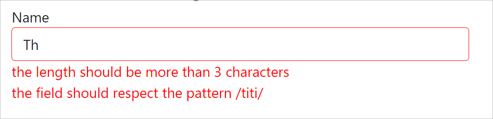
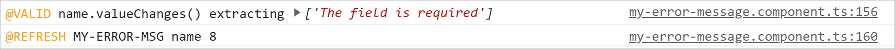

# MyValidators

This library was generated with [Angular CLI](https://github.com/angular/angular-cli) version 12.2.0.

For Angular 12.x.y => use @gpeel/my-validators 12.0.0 or more recent

For Angular 11.x.y => use @gpeel/plog@11.2.1 (last version for angular 11)

npm: https://www.npmjs.com/package/@gpeel/my-validators

github: https://github.com/gpeel/my-validators

## my validators npm install

        npm i @gpeel/my-validators

## my validators simplest example

To have all included validator messages as :



Validation error messages appear when the field is blurred or dirty. Thers is default debounce of 300ms (optionnaly
changeable)

## Setup

Declare in your AppModule the MyValidatorsModule:

````typescript
@NgModule({
  declarations: [
    AppComponent,
  ],
  imports: [
    FormsModule, ReactiveFormsModule, BrowserModule,
    //
    MyValidatorsModule, // <<< HERE
  ],
  bootstrap: [AppComponent]
})
export class AppModule {
}
````

## In you app code

Replace Angular Validators by MyValidators ie replace:
// import {Validators} from '@angular/forms';

with:
// import {MyValidators} from '@gpeel/my-validators';

BEFORE :

````typescript

this.form = this.fb.group({
  name: [this.originalName,
    [Validators.required,
      Validators.minLength(3),
      Validators.pattern(/titi/),
      this.myCustomValidatorForbiddenName]
  ],
});
````

AFTER :

````typescript

// import {MyValidators} from '@gpeel/my-validators';

this.form = this.fb.group({
  name: [this.originalName,
    [MyValidators.required,
      MyValidators.minLength(3),
      MyValidators.pattern(/titi/),
      this.myCustomValidatorForbiddenName]
  ],
});
````

And then add myErrorMsg in the \<input>

````html

<div class="form-group">
  <label for="name">Name</label>
  <input class="form-control" formControlName="name" id="name" myErrorMsg>
</div>
````

The myErrorMsg Directive will create a component under \<input> to show validation error messages.

That's ALL !

Of Course you can optionnaly place the error messages preceisely wher you want and customize the message with dedicated
services. Look at the examples on github https://github.com/gpeel/my-validators

## Strategy Validators / Error-Message

This is a 2-steps process:

1- the MyValidators will compute a "msg" property added to the control.error when invoked by Angular.

Example for 2 validation errors with minLength and pattern validators:

````typescript
name.errors = {
  "minlength": {
    "requiredLength": 3,
    "actualLength": 2,
    "msg": "the length should be more than 3 characters"  // <<<< added by MyValidators
  },
  "pattern": {
    "requiredPattern": "/titi/",
    "actualValue": "Th",
    "msg": "the field should respect the pattern /titi/ "  // <<<< added by MyValidators
  }
}
````

2- then the ui component <my-error-msg> extracts control.errors.<validators-key>.msg for each <validator-key> key
present in control.errors and show it HTML.

Since those 2 steps are completely disctinct, you can code validators that elaborate this "msg" property as you want (
inside an Angular service, connected to a i18n framework to get translation ..etc). And on the other you can devise
different UI components to show the errors in HTML.

See more realistic and flexible examples on github :

- reactive3-flexible-validators: this example provide a ValidatorService and a MessageService where you define the value
  of each validator error key.
- reactive4-i18n-transloco: extending from the reactive3-flexible-validators example and connecting the MessageService
  to a translator tool @ngneat/transloco in this case.

## (OPTIONAL) Placing the error messages where you want

The myErrorMsg Directive will create a component \<my-error-msg> to show the errors, but you can place it yourself on
the template and link the myErrorMsg directive to the \<my-error-msg> component with a template variable reference:

````html

<my-error-msg #nameErrors="myErrorMsg"></my-error-msg>

<div class="form-group">
  <label for="name2">Name2</label>
  <input [myErrorMsg]="nameErrors" class="form-control" formControlName="name2" id="name2">
</div>
````

In this example the validation errors will appear above ths \<input> and there is template var ref named #nameErrors (
the name could be anything). The template var hint **should be** 'myErrorMsg' because we want this var to reference the
COmponent instance of \<my-error-msg> which contains in the @Component the exportAs props :  'exportAs : 'myErrorMsg','.
Then finally we give the directive myErrorMsg this template variable as @Input parameter with [myErrorMsg]="
nameErrors".

So now myErrorMsg does have a reference to the component \<my-error-msg> and can exhange with it.

## Plog install in your main project (OPTIONNAL)

my-validators uses a simple logger @gpeel/plog to enable/disable the output logs of validators.

More information on:

https://github.com/gpeel/plog

If you want to activate those logs, in your main project do an explicit install:

        npm i @gpeel/plog

And declare :

        PlogModule.forRoot(environment) // <<< HERE, takes into account you loggers definition in environment.ts

## PROD environment.prod.ts

Your ./environments/environments.ts and environments-prod.ts would typically look like :

````typescript

export const environment = {
  production: false,
  plog: {
    error: 'color:red',
    warn: 'color:orange',
    // info: 'color:blue',
    // debug: 'color:limegreen;font-weight:bold',
  }
};
````

## DEV environment.ts

And your developpment environment.ts would typically activate much more loggers (here all are activated) :

You have specific loggers to have feedback when the @component \<my-error-msg> recomputes its error messages and what is
the value of control.errors for that \<input>.

- @REFRESH tells you each time the component is refreshed by Angular (on this picture, it is the 8th time the component
  has been refreshed)
- @VALID gives the error messages that will be shown

See below.



````typescript
export const environment = {
  production: false,
  plog: {
    debug: 'color:limegreen;font-weight:bold',
    info: 'color:blue',
    error: 'color:red',
    warn: 'color:orange',

    // Specific loggers for @gpeel/my-validators
    validationCompute: ['color:orange', '@VALID'], // tracing validators when they compute
    validationErrorMsgRefresh: ['color:orange', '@VALID_PERF'], // tracing refresh of <my-error-msg>
    validationErrorMsgCreation: ['color:orange', '@ERROR_MSG_NEW'], // tracing creation of component <my-error-msg>


    // NG hooks
    ngOnChanges: ['color:orange', 'OnChange'],
    ngOnInit: ['color:orange', 'OnInit'],
    ngOnDestroy: ['color:orange', 'OnDestroy'],
    ngDoCheck: ['color:orange', 'DoCheck'],
    ngAfterContentInit: ['color:orange', 'AfterContentInit'],
    ngAfterContentChecked: ['color:orange', 'AfterContentChecked'],
    ngAfterViewInit: ['color:orange', 'AfterViewInit'],
    ngAfterViewChecked: ['color:orange', 'AfterViewChecked'],

    // look at https://github.com/gpeel/plog
    // or at https://www.npmjs.com/package/@gpeel/plog
    // to have the complete list of loggers
  }
};

````
