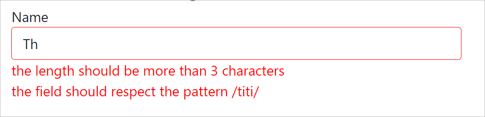
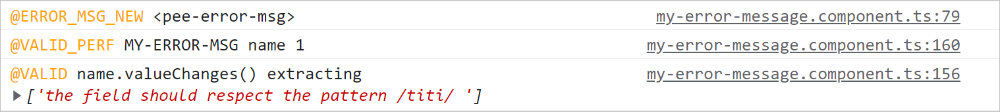

# Using my-validators : simplest

        npm i @gpeel/my-validators

## my validators simplest example

To have all included validator messages as :



Validation error messages appear when the field is blurred or dirty.

## Setup

Declare in your AppModule the MyValidatorsModule:

````typescript
@NgModule({
  declarations: [
    AppComponent,
  ],
  imports: [
    FormsModule, ReactiveFormsModule, BrowserModule,
    //
    MyValidatorsModule, // <<< HERE
  ],
  bootstrap: [AppComponent]
})
export class AppModule {
}
````

## IN you app code

Replace Angular Validators by MyValidators ie replace:
// import {Validators} from '@angular/forms';

with:
// import {MyValidators} from '@gpeel/my-validators'; BEFORE :

````typescript

this.form = this.fb.group({
  name: [this.originalName,
    [Validators.required,
      Validators.minLength(3),
      Validators.pattern(/titi/),
      this.myCustomValidatorForbiddenName]
  ],
});
````

AFTER :

````typescript

// import {MyValidators} from '@gpeel/my-validators';

this.form = this.fb.group({
  name: [this.originalName,
    [MyValidators.required,
      MyValidators.minLength(3),
      MyValidators.pattern(/titi/),
      this.myCustomValidatorForbiddenName]
  ],
});
````

Just add myErrorMsg in the \<input>

````html

<div class="form-group">
  <label for="name">Name</label>
  <input class="form-control" formControlName="name" id="name" myErrorMsg>
</div>
````

The myErrorMsg Directive will create a component under \<input> to show validation error messages.

## Strategy Validators / Error-Message

This is a 2-steps process

1- the MyValidators should compute a "msg" property when invoked ny Angular. Here the example is using MyValidators from
from '@gpeel/my-validators' where the standard validator method have been added a 'msg' into the return. it is the
simplest way of doing it, teh message is hard-coded in english.

2- then the ui component <my-error-msg> extract control.errors.<validators-name>.msg for each <validator-name> key
present in control.errors and show it HTML.

Since those 2 steps are completely disctinc, you can elaborate your error.msg as you want (inside an Angular service,
connected to a i18n framewotk to get translation ..etc).

See more realistic and flexible examples : reactive-flexible and reactive-i18n-transloco

## Plog install in your main project (OPTIONNAL)

my-validators uses a simple logger @gpeel/plog to enable/disable the output logs of validators.

It is installed by default as a dependency by @gpeel/my-validators, but is not active until you declare in your Module.

If you want to activate those logs, in your main project do an explicit install:

        npm i @gpeel/plog

And declare :

        PlogModule.forRoot(environment) // <<< HERE, takes into account you loggers definition in environment.ts

## PROD environment.prod.ts

Your ./environments/environments.ts and environments-prod.ts would typically look like :

````typescript

export const environment = {
  production: false,
  plog: {
    error: 'color:red',
    warn: 'color:orange',
    // info: 'color:blue',
    // debug: 'color:limegreen;font-weight:bold',
  }
};
````

## DEV environment.ts

And your developpment environment.ts would typically activate much more loggers (here all are activated) :

You have specifi loggers to have feedback when the @component \<my-error-msg> recomputes its error messages and what is
the value of control.errors for that \<input>. See below.



````typescript
export const environment = {
  production: false,
  plog: {
    debug: 'color:limegreen;font-weight:bold',
    info: 'color:blue',
    error: 'color:red',
    warn: 'color:orange',

    // Specific loggers for @gpeel/my-validators
    validationCompute: ['color:orange', '@VALID'], // tracing validators when they compute
    validationErrorMsgRefresh: ['color:orange', '@VALID_PERF'], // tracing refresh of <my-error-msg>
    validationErrorMsgCreation: ['color:orange', '@ERROR_MSG_NEW'], // tracing creation of component <my-error-msg>


    // NG hooks
    ngOnChanges: ['color:orange', 'OnChange'],
    ngOnInit: ['color:orange', 'OnInit'],
    ngOnDestroy: ['color:orange', 'OnDestroy'],
    ngDoCheck: ['color:orange', 'DoCheck'],
    ngAfterContentInit: ['color:orange', 'AfterContentInit'],
    ngAfterContentChecked: ['color:orange', 'AfterContentChecked'],
    ngAfterViewInit: ['color:orange', 'AfterViewInit'],
    ngAfterViewChecked: ['color:orange', 'AfterViewChecked'],

    // look at https://github.com/gpeel/plog
    // or at https://www.npmjs.com/package/@gpeel/plog
    // to have the complete list of loggers
  }
};

````
